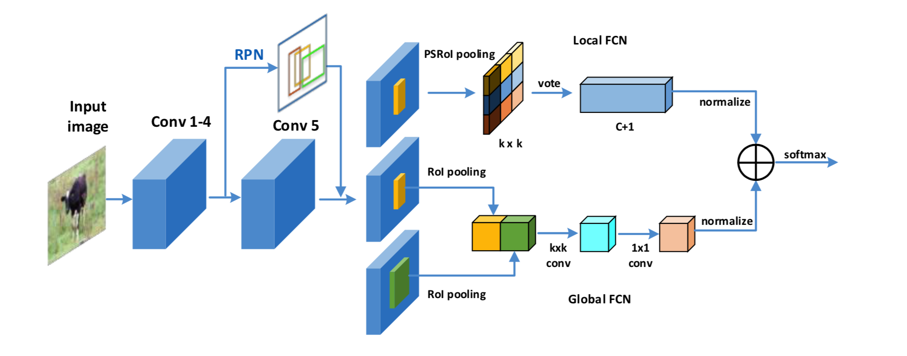
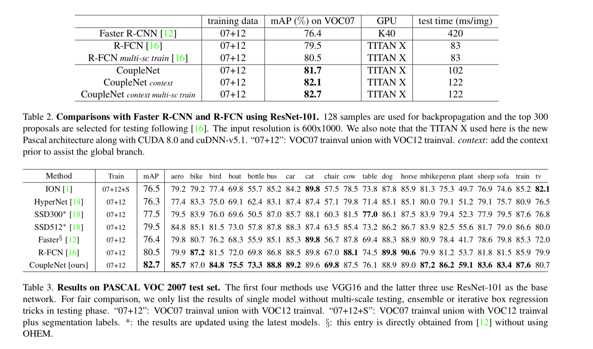

R-FCN将RoI划分成区域通过整合各个区域的信息来表征最后的结果，而CoupleNet的motivation是利用R-FCN中对局部信息的学习能力再整合全局和context信息来提升模型的检测效果。

CoupleNet网络主要分成两个分支：
1.      Local FCN：引入R-FCN中的Position-sensitive score maps 和 Position-sensitive RoI pooling 得到局部信息给出的结果，对于分类会输出C+1维的特征向量，具体细节直接参考R-FCN即可。
2.      Global FCN：这个分支主要用来整合RoI的全局信息和context信息，上图中的两个RoI Pooling就是分别来映射这部分特征的，第一部分是全局的特征信息，第二部分是在第一部分RoI的基础上范围向外扩大2倍再进心RoI Pooling这样可以引入部分的context信息来增强特征提高检测的效果，最后两者feature map直接concat到一起经过kxk和1x1两个卷积层之后同样得到C+1维的特征向量
3.      Coupling structure：两个分支输出的整合作者也做了很多的实验，(L2 normalization layer , 1x1 conv layer)  x (element-wise max, element-wise product, element-wise sum) 共6种组合中1x1 conv + element-wise sum 表现最好。

实验结果，速度方面因为CoupleNet相当于在R-FCN的基础上引入了Global FCN的分支，所以很显然速度要慢于R-FCN的，但还是明显快于faster rcnn的，检测效果方面效果也很好。

