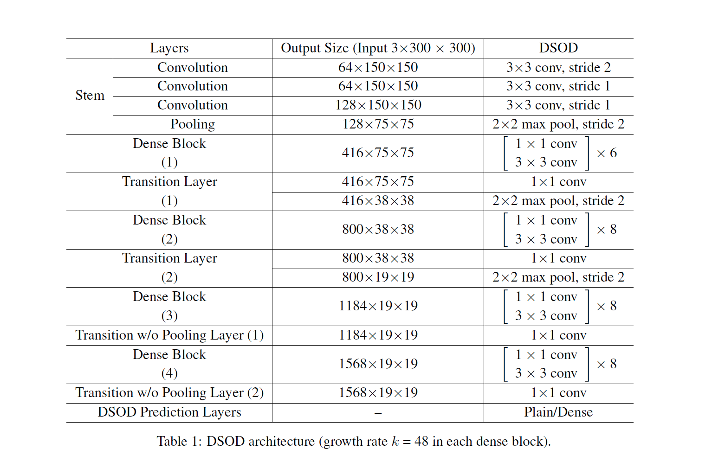
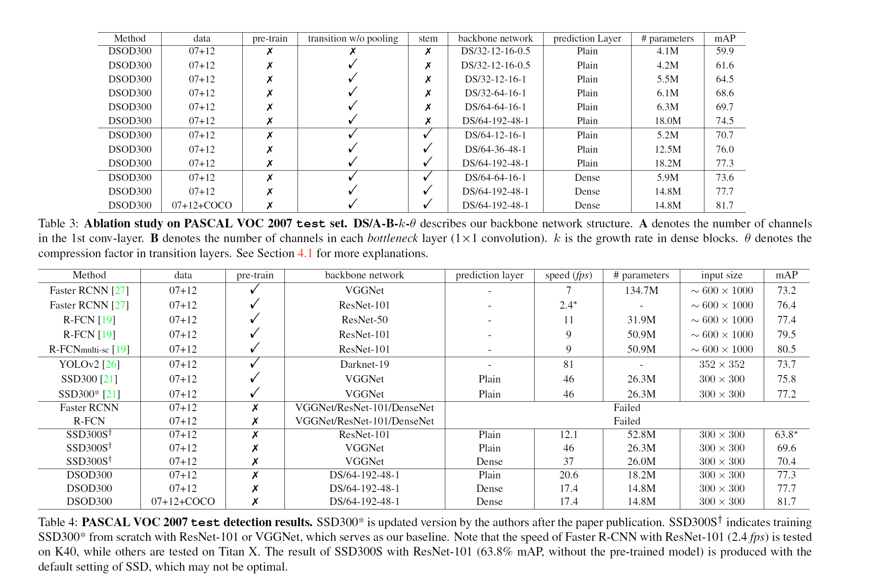

论文主要想解决的问题是如何直接去训练一个detection模型，因为现在detection模型都是利用ImageNet数据预训练的，灵活性相对较差，分类和检测的场景也不一致，因此论文提出了DSOD模型。
论文中提出的DSOD模型结构通过下表可以直观的看到，Stem、Dense Block、Transition Layer都是参考现有的研究成果，论文主要的贡献是
 Transition w/o Pooling Layer 和 Dense Prediction Structure：
1.      Transition w/o Pooling Layer：这个结构主要用来实现增加Densen Block模块个数的同时保持输出的size不变，从表中可以直观的看到其实就是1x1的卷积，
因为传统densenet中的transition layer会利用pooling层来对feature map下采样，这里用Transition w/o Pooling Layer来保持输出的size与transition layer区分开。

2. Dense Prediction Structure：论文中用下图来解释Dense Prediction Structure，和常用的结构（左侧）相比较主要的差别在于 Learning Half and Reusing Half，
每一层网络的输入都是上一层的输出feature map 和 前面层的下采样结果的concatenate，因此对于每一层的输出一半是通过学习得到的另一半则是直接从前面层
下采样得到的，这样可以直接复用前面的信息。

具体的实验结果，或许看完这篇文章最好奇的是从头训练的检测模型和预训练过的检测模型具体效果的好坏，论文的最后作者利用
 DS/64-12-16-1做了比较，发现从头训练的模型效果要好于预训练过的模型（70.7% vs 70.3%）

