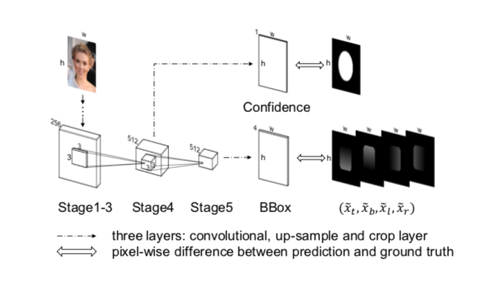

You can find this paper [here](https://arxiv.org/pdf/1608.01471.pdf)
# Two Main Contributions:
## - **IoU Loss**
在目前的神经网络训练中，L2 Loss是比较常用的Loss函数，它其实就是欧式距离的计算，L2 Loss有两个比较典型的缺点：
1. 在L2 Loss中，Bounding Box的四个角被看作相互独立的单元，计算Loss的时候都是分别去优化左上角的坐标和Bounding Box的长、宽，但是实际上在检测问题中一个物体的边界是高度相关的。忽略其中的联系也会导致一些badcase，比如预测的Bounding Box可能有一、两条边和Ground Truth的很接近但是整个预测的Bounding Box偏离的比较离谱。
2. 标准的L2 Loss是没有normalize的, 那么在训练过程中模型就会更加关注大一点的Bounding Box，当然现在也有了很多normalize的方法被提出来。

基于此，论文作者提出了IoU Loss：

## - UnitBox Network Structure

